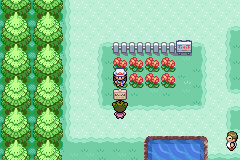

# Pokemon-FR-Native-RTC
 Inyección de código para implementar RTC nativo dentro de una rom de pokémon fire red.

Adaptación del código para pokefirered de: https://github.com/Sotomura/pokefirered/tree/pokefirered-rtc
 

### Instrucciones:

- DevkitARM y ARMIPS son necesarios (versiones más recientes).

- Para compilar es necesario tener preproc.exe y gbagfx.exe dentro alguna ruta de la variable PATH

- Modificar el archivo Makefile para cambiar el offset y la rom con la que vamos a trabajar. Buscamos las siguientes líneas:
        
        ROM_CODE ?= BPRE
        OFFSET ?= 0x08730000
    - Cambiamos 730000 por un offset alienado con suficiente espacio libre (cerca de `0x6000` bytes). Se puede insertar en espacio expandido de la rom, cambiando el 0x08 por 0x09 al inicio del offset.
    - Cambiamos BPRE por BPRS si vas a compilar en una rom Rojo Fuego española.

- Dentro de la carpeta raíz del proyecto, poner una rom con extensión de archivo .gba
    - con nombre BPRE si usa Fire Red
    - con nombre BPRS si usa Rojo Fuego `no implementado aún`

- Compilan ejecutando make. Se genera una nueva carpeta llamada “build” y adentro encontrará un archivo `rom_bpre.gba` (`rom_bprs.gba` en caso de Rojo Fuego) que tendrá el código compilado. Pueden abrir el archivo `offset.txt` para revisar los offset donde se ha insertado el código compilado.

***Notas:***
- Para configurar el reloj de pared, se usa el special 0x9A. Este recibe como parámetro la variable 0x8004, si es 0 usa la paleta para la chica, y 1 para el chico. Combinar con checkgender y asignar una flag para comprobar si ya se ha configurado antes.
- Para ver ver el reloj
- Un ejemplo de cómo podría quedar el script en XSE:
        
        #dynamic 0x800000
        #org @main
        lockall
        checkgender
        copyvar LASTRESULT 0x8004
        checkflag 0x35C
        if 0x1 goto @snippet2
        msgbox @string1 MSG_KEEPOPEN
        call @snippet3
        pause 0x1E
        setflag 0x35C
        call @snippet4
        sound 0x9
        releaseall
        end
        
        '---------------
        #org @snippet2
        fadescreen 0x1
        special 0x9A
        waitstate
        releaseall
        end
        
        '---------------
        #org @snippet3
        fadescreen 0x1
        special 0x9A
        waitstate
        return
        
        '---------------
        #org @snippet4
        msgbox @string2 MSG_KEEPOPEN
        closeonkeypress
        return
        
        '---------------
        #org @string1
        = El reloj está detenido[.]\pHora de configurarlo e iniciarlo.
        
        '---------------
        #org @string2
        = [player]: ¡Ahora el reloj está funcionando\ncorrectamente!

- Archivos dentro de la carpeta include fueron tomados de pokefirered.

***Capturas:***

